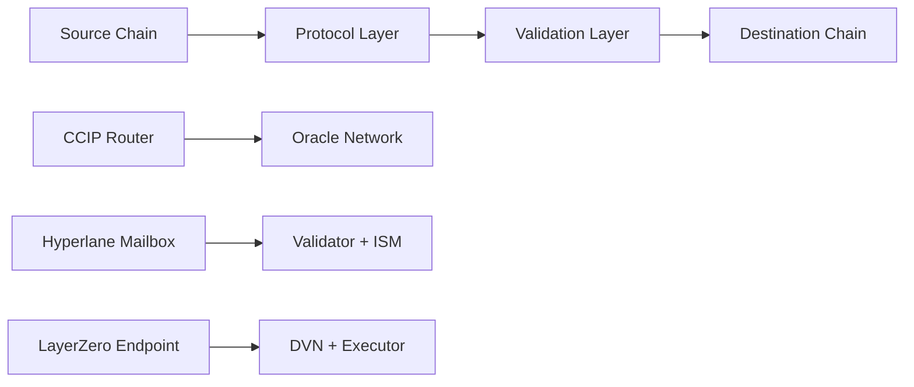

# B3Bridge Smartcontracts

<p align="center">
  
</p>

<h1 align="center">Multi-Protocol Cross-Chain Bridge Ecosystem</h1>

<p align="center">A comprehensive smart contract ecosystem enabling secure token transfers across multiple blockchain networks using Chainlink CCIP, Hyperlane, and LayerZero v2 protocols.</p>

<p align="center">
  <a href="https://docs.chain.link/ccip" style="color: #375BD2">Chainlink CCIP</a> |
  <a href="https://docs.hyperlane.xyz/" style="color: #FF6B6B">Hyperlane</a> |
  <a href="https://docs.layerzero.network/v2" style="color: #4CAF50">LayerZero v2</a>
</p>

## 🌟 Features

🔗 **Multi-Protocol Support**: Three leading cross-chain protocols (CCIP, Hyperlane, LayerZero v2)
🔐 **Enterprise Security**: Multi-signature validation with configurable thresholds
🌐 **Multi-Chain Coverage**: Ethereum, BSC, Avalanche, Sei Network support

## 📁 Project Structure

This repository contains three distinct but interconnected smart contract projects:

### 🔵 EVM Contracts (`evm-contracts/`)
Cross-chain bridge implementation for Ethereum-compatible networks using Chainlink CCIP and Hyperlane protocols.

**Key Features:**
- Chainlink CCIP integration
- Hyperlane protocol with flexible routing and fee structures
- Support for ETH, USDC, USDT bridging
- Multi-signature validator consensus
- Dynamic fee calculation with price feeds

**Supported Networks:**
- Ethereum Mainnet & Sepolia Testnet
- BSC Mainnet & BSC Testnet

### 🟣 Cosmos Contracts (`cosmos-contracts/`)
Specialized bridge implementation for Sei Network ecosystem with CCIP and Hyperlane support.

**Key Features:**
- Native Sei Network integration with custom oracles
- WETH and WUSDC wrapped token implementations
- Dual protocol support (CCIP + Hyperlane)
- Sei-specific price feed integration
- Emergency controls and circuit breakers

**Supported Networks:**
- Sei Mainnet (Chain ID: 1329)
- Sei Testnet (Chain ID: 1328)

### 🟢 Launchpad Contracts (`launchpad-contracts/`)
Advanced token launchpad system built on LayerZero v2 OFT standard with presale functionality.

**Key Features:**
- Omnichain Fungible Token (OFT) implementation
- Comprehensive presale system with soft/hard caps
- Native token and ERC20 payment support
- Batch minting and supply management
- Cross-chain token distribution

**Supported Networks:**
- Ethereum, BSC, Avalanche (Mainnet & Testnet)
- LayerZero v2 pathway configurations

## 🚀 Quick Start

### Prerequisites
- Node.js >= 16.0.0 (>= 18.16.0 for launchpad)
- npm, yarn, or pnpm
- Git

### Installation
```bash
# Clone the repository
git clone <repository-url>
cd b3bridge-smartcontracts

# Install dependencies for each project
cd evm-contracts && npm install && cd ..
cd cosmos-contracts && npm install && cd ..
cd launchpad-contracts && pnpm install && cd ..
```

### Environment Setup
Each project uses dual environment configuration:

```bash
# EVM Contracts
cd evm-contracts
cp .env.dev .env      # For testnet development
# or
cp .env.prod .env     # For mainnet deployment

# Cosmos Contracts
cd cosmos-contracts
cp .env.dev.example .env   # For Sei testnet
# or
cp .env.prod.example .env  # For Sei mainnet

# Launchpad Contracts
cd launchpad-contracts
cp .env.example .env  # Configure with your keys
```

## 🛠️ Development Commands

### EVM Contracts
```bash
cd evm-contracts

# Compilation
npm run compile:dev     # Development environment
npm run compile:prod    # Production environment

# Deployment
npm run deploy:bridge:testnet    # CCIP bridge to Sepolia
npm run deploy:hyperlane:testnet # Hyperlane bridge to testnet

# Testing
npx hardhat test
```

### Cosmos Contracts
```bash
cd cosmos-contracts

# Compilation
npm run compile:dev     # Sei testnet environment
npm run compile:prod    # Sei mainnet environment

# Deployment
npm run deploy:bridge:testnet     # Bridge to Sei testnet
npm run deploy:weth:testnet       # WETH token to Sei testnet
npm run deploy:hyperlane:testnet  # Hyperlane to Sei testnet

# Verification
npx hardhat verify --network sei <contract_address>
```

### Launchpad Contracts
```bash
cd launchpad-contracts

# Compilation (Dual system: Hardhat + Foundry)
pnpm compile            # Both compilers
pnpm compile:hardhat    # Hardhat only
pnpm compile:forge      # Foundry only

# Testing
pnpm test               # All tests
pnpm test:forge         # Foundry tests
pnpm test:hardhat       # Hardhat tests

# LayerZero Operations
pnpm hardhat lz:deploy --tags BambooOFT
pnpm hardhat lz:oapp:wire --oapp-config layerzero.config.ts
pnpm hardhat lz:oft:send --src-eid 40161 --dst-eid 40102 --amount 100

# Code Quality
pnpm lint               # All linting
pnpm lint:fix           # Auto-fix issues
```

## 🔗 Cross-Chain Architecture

### Protocol Comparison

| Feature | Chainlink CCIP | Hyperlane | LayerZero v2 |
|---------|---------------|-----------|--------------|
| **Security Model** | Decentralized Oracle Network | Modular Security Stack | Ultra Light Node + DVN |
| **Message Verification** | Multiple Independent Oracles | Validator + Relayer | Oracle + Relayer |
| **Finality** | Probabilistic | Configurable | Configurable |
| **Gas Efficiency** | High (Optimized) | Medium (Flexible) | High (Ultra Light) |
| **Network Coverage** | Growing Rapidly | Extensive | Most Comprehensive |
| **Use Case** | Enterprise/High Value | Flexible Applications | Omnichain Applications |

### Bridge Flow Architecture



## 🛡️ Security Features

### Multi-Signature Validation
- **Configurable Thresholds**: M-of-N signature requirements
- **ECDSA Verification**: Cryptographic signature validation
- **Validator Management**: Dynamic validator set updates
- **Replay Protection**: Transaction uniqueness tracking

### Emergency Controls
- **Pausable Contracts**: Emergency stop functionality
- **Circuit Breakers**: Automatic anomaly detection
- **Timelock Mechanisms**: Delayed sensitive operations
- **Role-Based Access**: Granular permission system

### Audit & Compliance
- **OpenZeppelin Standards**: Industry-standard security patterns
- **Reentrancy Guards**: Protection against reentrancy attacks
- **Input Validation**: Comprehensive parameter checking
- **Event Logging**: Complete operation transparency

## 📊 Gas Optimization

### Profiling Tools
```bash
# LayerZero gas profiling (launchpad-contracts)
pnpm gas:lzReceive <rpcUrl> <endpointAddress> <params...>
pnpm gas:lzCompose <rpcUrl> <endpointAddress> <params...>

# Hardhat gas reporting (all projects)
REPORT_GAS=true npx hardhat test
```

### Optimization Strategies
- **Packed Structs**: Optimized storage layout
- **Batch Operations**: Multiple operations per transaction
- **Proxy Patterns**: Upgradeable contracts with minimal deployment cost
- **Selective Storage**: Minimized state changes

## 🧪 Testing Strategy

### Comprehensive Coverage
- **Unit Tests**: Individual contract function validation
- **Integration Tests**: Cross-contract interaction testing
- **Fork Tests**: Real network condition simulation
- **Fuzzing Tests**: Edge case discovery (Foundry)

### Mock Infrastructure
- **Mock CCIP Router**: Local CCIP simulation
- **Mock Oracles**: Deterministic price feeds
- **Mock Tokens**: ERC20 test implementations
- **LayerZero Mocks**: Cross-chain simulation

## 📚 Documentation

### Individual Project Documentation
- [`evm-contracts/README.md`](./evm-contracts/README.md): EVM bridge implementation details
- [`cosmos-contracts/README.md`](./cosmos-contracts/README.md): Sei Network bridge guide
- [`launchpad-contracts/README.md`](./launchpad-contracts/README.md): LayerZero OFT and presale system

### External Resources
- [Chainlink CCIP Documentation](https://docs.chain.link/ccip)
- [Hyperlane Documentation](https://docs.hyperlane.xyz/)
- [LayerZero v2 Documentation](https://docs.layerzero.network/v2)

## 🤝 Contributing

1. **Fork the repository**
2. **Create a feature branch** (`git checkout -b feature/amazing-feature`)
3. **Choose the appropriate sub-project** for your changes
4. **Follow project-specific conventions** (see individual README files)
5. **Add comprehensive tests** for new functionality
6. **Ensure all tests pass** (`npm test` or `pnpm test`)
7. **Run linting** (`npm run lint` or `pnpm lint:fix`)
8. **Submit a pull request** with detailed description

### Development Workflow
1. **Environment Setup**: Configure appropriate `.env` files
2. **Compilation**: Use project-specific compilation commands
3. **Testing**: Run comprehensive test suites
4. **Security Review**: Validate security implications
5. **Documentation**: Update relevant documentation

## ⚠️ Security Considerations

- **Testnet First**: Always test on testnets before mainnet deployment
- **Multi-sig Wallets**: Use multi-signature wallets for admin operations
- **Regular Audits**: Conduct periodic security audits
- **Monitor Operations**: Set up monitoring for bridge operations
- **Incident Response**: Have emergency procedures ready

## 🆘 Support

For support and questions:
- **Issues**: Create detailed issues in this repository
- **Documentation**: Check project-specific README files
- **Security**: Report security vulnerabilities privately

---

<p align="center">
  <strong>B3Bridge</strong> - Bridging the Multi-Chain Future
</p>